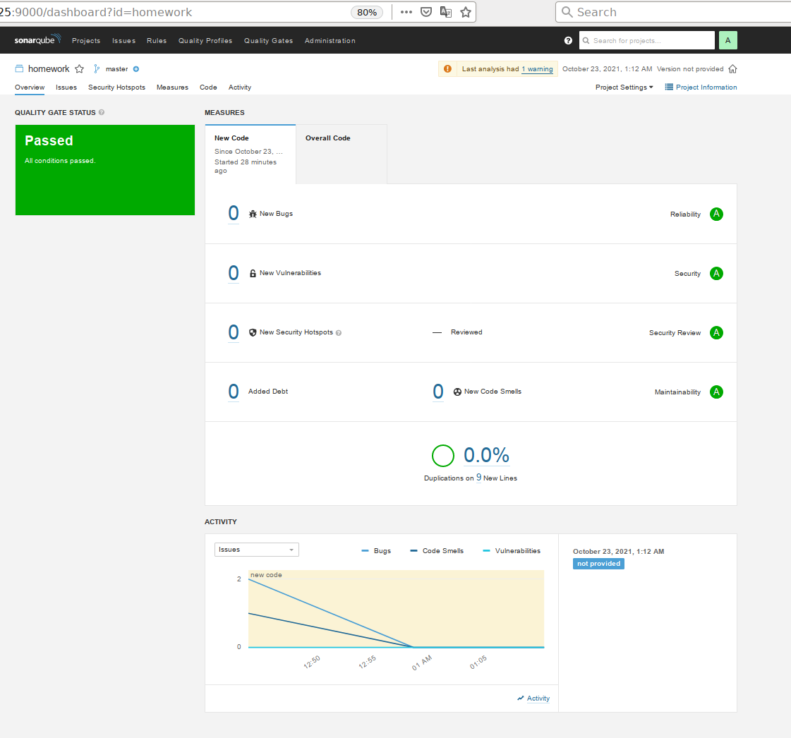

# Домашняя работа по занятию "09.03 CI\CD"


> ## Знакомоство с SonarQube
> 9. Делаем скриншот успешного прохождения анализа, прикладываем к решению ДЗ



---
> ## Знакомство с Nexus
> 4. В ответе присылаем файл `maven-metadata.xml` для этого артефекта

[maven-metadata.xml](maven-metadata.xml):
```xml
<?xml version="1.0" encoding="UTF-8"?>
<metadata modelVersion="1.1.0">
  <groupId>netology</groupId>
  <artifactId>java</artifactId>
  <versioning>
    <latest>8_282</latest>
    <release>8_282</release>
    <versions>
      <version>8_102</version>
      <version>8_282</version>
    </versions>
    <lastUpdated>20211022235656</lastUpdated>
  </versioning>
</metadata>
```

---
> ## Знакомство с Maven
> 3. Проверяем директорию `~/.m2/repository/`, находим наш артефакт

```
$ find  ~/.m2/repository/ |grep tar.gz
/home/mak/.m2/repository/netology/java/8_282/java-8_282-distrib.tar.gz.sha1
/home/mak/.m2/repository/netology/java/8_282/java-8_282-distrib.tar.gz
``` 

> 4. В ответе присылаем исправленный файл `pom.xml`

[pom.xml](pom.xml):
```xml
<project xmlns="http://maven.apache.org/POM/4.0.0" xmlns:xsi="http://www.w3.org/2001/XMLSchema-instance"
  xsi:schemaLocation="http://maven.apache.org/POM/4.0.0 http://maven.apache.org/xsd/maven-4.0.0.xsd">
  <modelVersion>4.0.0</modelVersion>
 
  <groupId>com.netology.app</groupId>
  <artifactId>simple-app</artifactId>
  <version>1.0-SNAPSHOT</version>
   <repositories>
    <repository>
      <id>homework-repo</id>
      <name>maven-public</name>
      <url>http://84.201.135.122:8081/repository/maven-public/</url>
    </repository>
  </repositories>
  <dependencies>
     <dependency>
      <groupId>netology</groupId>
      <artifactId>java</artifactId>
      <version>8_282</version>
      <classifier>distrib</classifier>
      <type>tar.gz</type>
    </dependency>
  </dependencies>
</project>
```