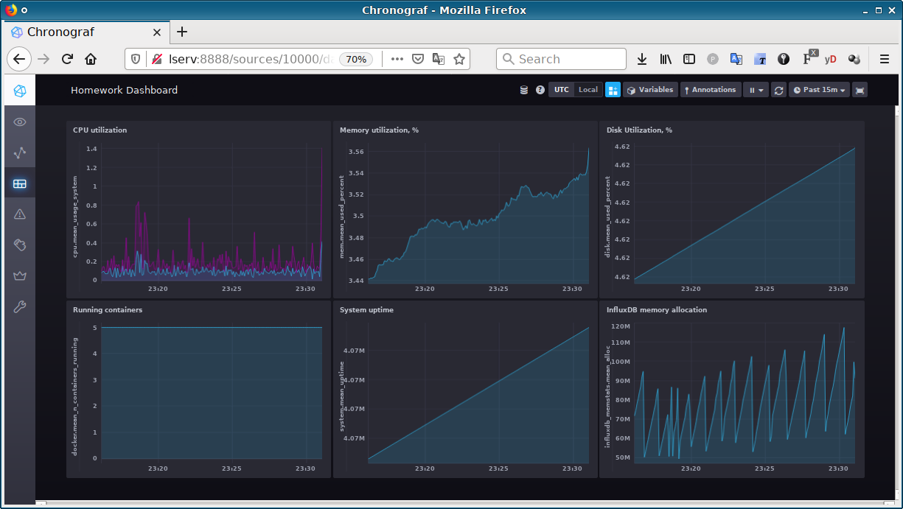

# Домашняя работа по занятию "10.02. Системы мониторинга"

> 1. Опишите основные плюсы и минусы pull и push систем мониторинга.

К плюсам push модели (когда агент на клиенте сам инициирует отправку метрик) можно отнести:
- проще конфигурится отправка метрик в несколько серверов мониторинга;
- возможность гибкой настройки отсылки разных метрик - интервалы, отправка телеметрии по событиям;
- для несильно важных данных можно воспользоваться отправкой метрик по UDP, что убыстряет их отсылку и экономит трафик
- клиенту не приходится хранить много метрик, пока их наконец-то не заберут.
- лучше для каких-то кратковременных/эфемерных заданий (jobs/batch). Задание выполнилось, метрики отправились, всё.

Плюсы pull-модели:
- проще контролировать подлинность данных. Мы получаем метрики только от нами сконфигурированных клиентов, а не от кого попало.
- проще шифровать данные. Если мы будем терминировать наше защищённое HTTPS-соединение на реверс-прокси, клиентам не нужно связываться с индивидуальными сертификатами.
- легче тестировать / отлаживать получение метрик. Разработчик может подключиться по HTTP непосредственно к клиенту и забрать с него метрики.

Минусы в общем случае происходят из плюсов. Так, для pull-модели минусами будет невозможность воспользоваться легковесным UDP, или забирать метрики по событиям (event-driven)

Если сервер внутри защищённого периметра сети за NATом, а клиенты снаружи - будет затруднительно воспользоваться push-моделью. 
Если наоборот, то будет страдать pull-модель. Несколько улучшить положение могут разного рода прокси и push-гейтвеи.

---
> 2. Какие из ниже перечисленных систем относятся к push модели, а какие к pull? А может есть гибридные?
>   - Prometheus

Основная модель для Prometheus - pull. Но у него есть pushgateway, так что можно отнести к гибридным.

>    - TICK

Стек TICK работает с push-моделью. Впрочем, его компонент Telegraf, осуществляющий сбор метрик, можно настроить на работу с pull-моделью.

    - Zabbix

Zabbix работает с push-моделью.

>    - VictoriaMetrics

VictoriaMetrics это Time-series database, т.е. применительно к ней наверное вообще некорректно рассуждать про push/pull model. 
Ну или, как и с любой другой базой данных, в неё данные push'ат. 

    - Nagios

Nagios можно отнести к гибридным системам, в зависимости от используемых компонентов. Если он сам опрашивает дивайсы 
по SNMP, это будет pull. Так же с pull-моделью работают его Nagios Remote Plugin Executor (NRPE). А вот Nagios Service 
Check Acceptor (NSCA) работает с push-моделью.


---
> 3. Склонируйте себе [репозиторий](https://github.com/influxdata/sandbox/tree/master) и запустите TICK-стэк, 
используя технологии docker и docker-compose.
В виде решения на это упражнение приведите выводы команд с вашего компьютера (виртуальной машины):
    - curl http://localhost:8086/ping

```
mak@test-xu20:~$ curl http://localhost:8086/ping
```
Вообще тишина! Впрочем, какие-то заголовки отдаются:
```
mak@test-xu20:~$ curl -D - http://localhost:8086/ping
HTTP/1.1 204 No Content
Content-Type: application/json
Request-Id: 6c8ec56e-3c19-11ec-8b2d-0242ac150002
X-Influxdb-Build: OSS
X-Influxdb-Version: 1.8.10
X-Request-Id: 6c8ec56e-3c19-11ec-8b2d-0242ac150002
Date: Tue, 02 Nov 2021 20:14:03 GMT
```

<cite>"By default, the `/ping` HTTP endpoint returns a simple HTTP 204 status response to let the client know that the server is running. Default value is false. When verbose option is set to true (`/ping?verbose=true`), an HTTP 200 status is returned.".</cite>
И действительно:
```
mak@test-xu20:~$ curl http://localhost:8086/ping?verbose=true
{"version":"1.8.10"}
```

>    - curl http://localhost:8888

```
mak@test-xu20:~$ curl http://localhost:8888
<!DOCTYPE html><html><head><meta http-equiv="Content-type" content="text/html; charset=utf-8"><title>Chronograf</title><link rel="icon shortcut" href="/favicon.fa749080.ico"><link rel="stylesheet" href="/src.3dbae016.css"></head><body> <div id="react-root" data-basepath=""></div> <script src="/src.fab22342.js"></script> </body></html>
```

>    - curl http://localhost:9092/kapacitor/v1/ping

<cite>"You can ‘`ping`’ the Kapacitor server to validate you have a successful connection. A ping request does nothing but respond with a 204."</cite>:
```
mak@test-xu20:~$ curl -D- http://localhost:9092/kapacitor/v1/ping
HTTP/1.1 204 No Content
Content-Type: application/json; charset=utf-8
Request-Id: c60313a1-3c1a-11ec-8c7b-000000000000
X-Kapacitor-Version: 1.6.2
Date: Tue, 02 Nov 2021 20:23:43 GMT
```

А также скриншот веб-интерфейса ПО chronograf (`http://localhost:8888`).


---
> 4. Перейдите в веб-интерфейс Chronograf (`http://localhost:8888`) и откройте вкладку `Data explorer`.
>    - Нажмите на кнопку `Add a query`
>    - Изучите вывод интерфейса и выберите БД `telegraf.autogen`
>    - В `measurments` выберите mem->host->telegraf_container_id , а в `fields` выберите used_percent. 
>    Внизу появится график утилизации оперативной памяти в контейнере telegraf.

Возможно, это от версии зависит, но у меня нет таких метрик. Вот что есть:
```
Entering the influx cli...
Connected to http://localhost:8086 version 1.8.10
InfluxDB shell version: 1.8.10
> use telegraf.autogen
Using database telegraf
Using retention policy autogen
> SHOW MEASUREMENTS
name: measurements
name
----
cpu
influxdb
influxdb_cq
influxdb_database
influxdb_httpd
influxdb_memstats
influxdb_queryExecutor
influxdb_runtime
influxdb_shard
influxdb_subscriber
influxdb_tsm1_cache
influxdb_tsm1_engine
influxdb_tsm1_filestore
influxdb_tsm1_wal
influxdb_udp
influxdb_write
system
> 
```

> Для выполнения задания приведите скриншот с отображением метрик утилизации места на диске 
(disk->host->telegraf_container_id) из веб-интерфейса.

Диска тоже нету, зато есть Load Average. Красивое!


> 5. Изучите список [telegraf inputs](https://github.com/influxdata/telegraf/tree/master/plugins/inputs). 
Добавьте в конфигурацию telegraf следующий плагин - [docker](https://github.com/influxdata/telegraf/tree/master/plugins/inputs/docker):
> ```
> [[inputs.docker]]
>  endpoint = "unix:///var/run/docker.sock"
> ```

А он там уже есть!

А вот `[[inputs.mem]]` и `[[inputs.disk]]` как раз не было, я их добавил, и наконец-то их метрики проявились.  
Вот дисковые, для предыдущего пункта:


> Дополнительно вам может потребоваться донастройка контейнера telegraf в `docker-compose.yml` дополнительного volume и 
режима privileged:  
...  
> После настройке перезапустите telegraf, обновите веб интерфейс и приведите скриншотом список `measurments` в 
веб-интерфейсе базы telegraf.autogen . Там должны появиться метрики, связанные с docker.

А вот метрик не было!
В логах контейнера сплошные обиды на права доступа:  
`telegraf_1       | 2021-11-02T22:20:50Z E! [inputs.docker] Error in plugin: Got permission denied while trying to connect to the Docker daemon socket at unix:///var/run/docker.sock: Get "http://%2Fvar%2Frun%2Fdocker.sock/v1.21/containers/json?filters=%7B%22status%22%3A%5B%22running%22%5D%7D&limit=0": dial unix /var/run/docker.sock: connect: permission denied`

privileged режим ничем не помог, а помогло пересобрать telegraf-контенер, с включением пользователя telegraf в группу доступа к docker-сокету.
Вот docker-метрики и проявились.  


---
> ### Дополнительное задание (со звездочкой*) - необязательно к выполнению
> В веб-интерфейсе откройте вкладку `Dashboards`. Попробуйте создать свой dashboard с отображением:

