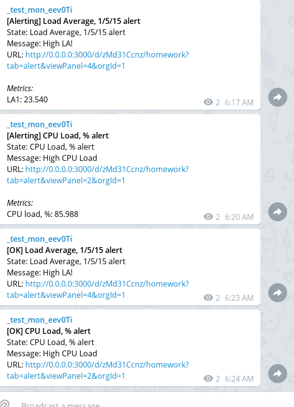
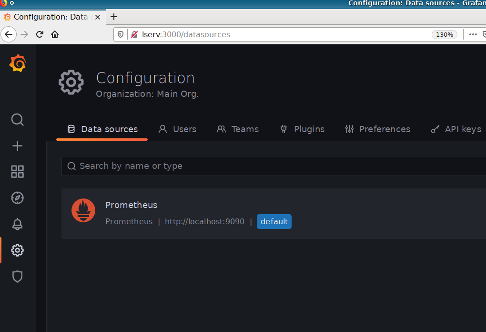
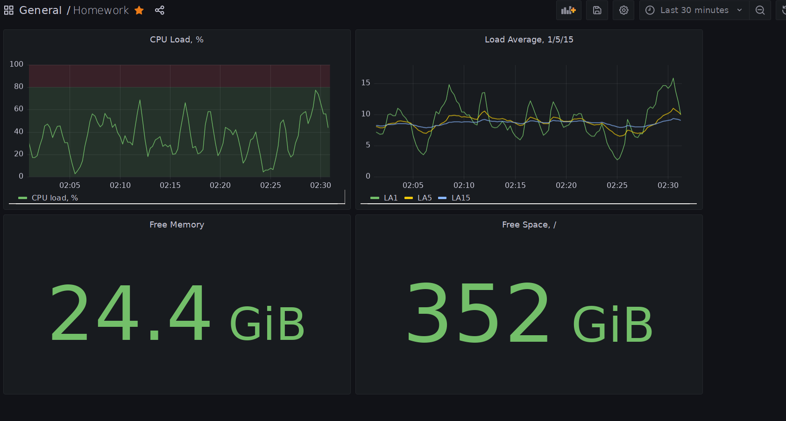
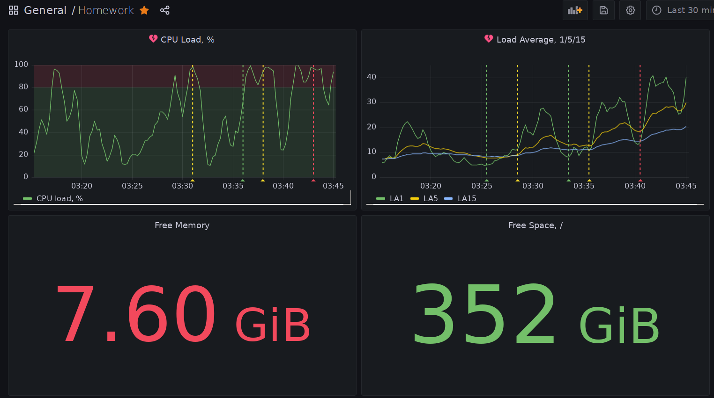

# Домашняя работа по занятию "10.03. Grafana"

## Задание повышенной сложности

>**В части задания 1** не используйте директорию `help` для сборки проекта, самостоятельно разверните grafana, где в 
роли источника данных будет выступать prometheus, а сборщиком данных node-exporter:
...
В решении к домашнему заданию приведите также все конфигурации/скрипты/манифесты, которые вы 
использовали в процессе решения задания.

* [==> site.yml](site.yml)
* [==> requirements.yml](requirements.yml)


>**В части задания 3** вы должны самостоятельно завести удобный для вас канал нотификации, например Telegram или Email
и отправить туда тестовые события.
В решении приведите скриншоты тестовых событий из каналов нотификаций.



---
## Обязательные задания

> ### Задание 1
> Решение домашнего задания - скриншот веб-интерфейса grafana со списком подключенных Datasource.



---
> ## Задание 2
> Создайте Dashboard и в ней создайте следующие Panels:
> - Утилизация CPU для nodeexporter (в процентах, 100-idle)
> - CPULA 1/5/15
> - Количество свободной оперативной памяти
> - Количество места на файловой системе
> Для решения данного ДЗ приведите promql запросы для выдачи этих метрик, а также скриншот получившейся Dashboard.

```
100 - avg without(cpu) (rate(node_cpu_seconds_total{mode="idle"}[1m])) * 100
node_load1
node_load5
node_load15
node_memory_MemFree_bytes
node_filesystem_avail_bytes{mountpoint='/'}
```


---
> ## Задание 3
>Создайте для каждой Dashboard подходящее правило alert (можно обратиться к первой лекции в блоке "Мониторинг").
Для решения ДЗ - приведите скриншот вашей итоговой Dashboard.

(к сожалению, для таблиц с цифрами сделать алерт недоступно)


---
>## Задание 4
>Сохраните ваш Dashboard.
Для этого перейдите в настройки Dashboard, выберите в боковом меню "JSON MODEL".
Далее скопируйте отображаемое json-содержимое в отдельный файл и сохраните его.
В решении задания - приведите листинг этого файла.

Там даже экспорт файла есть.
* [Homework dashboard](HW.json)

