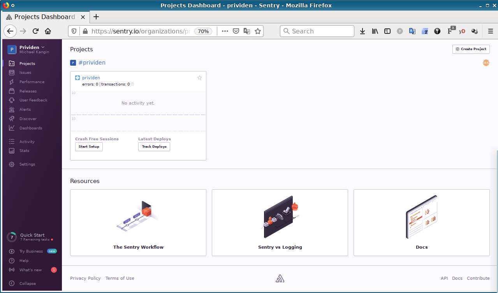
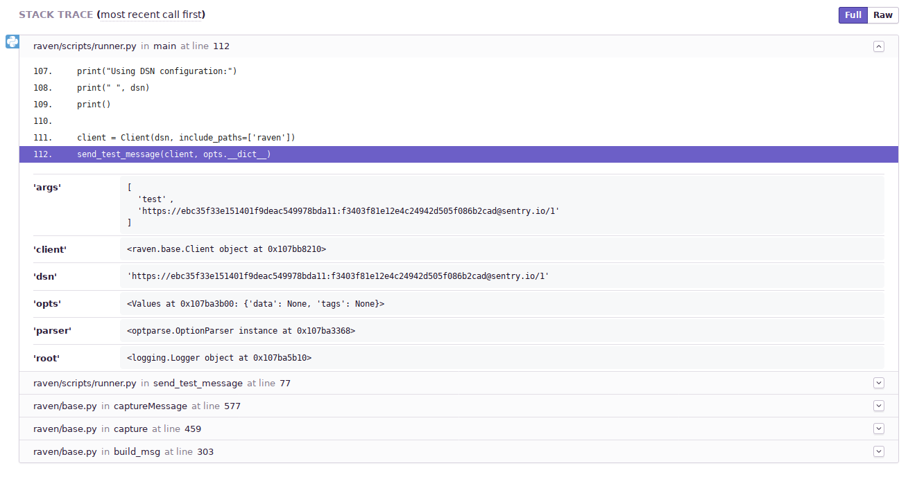
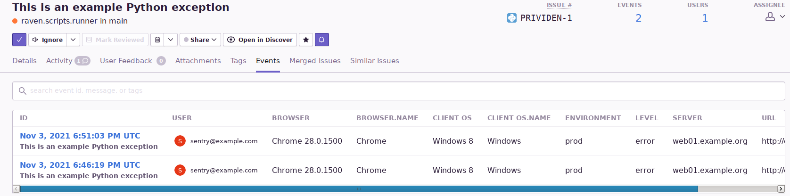
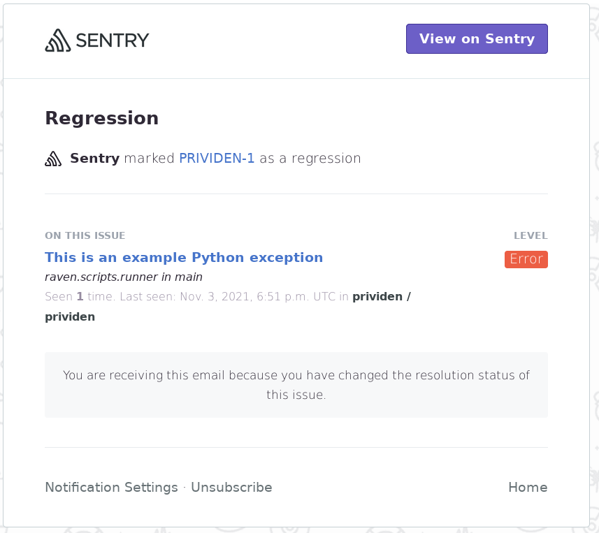
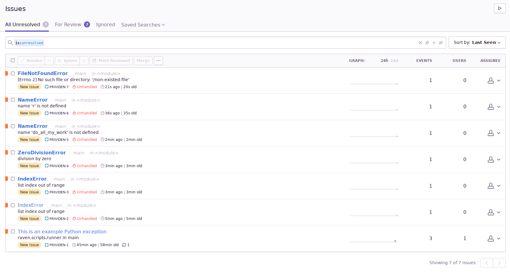

# Домашняя работа по занятию "10.05. Sentry"

> ## Задание 1
Для выполнения задания - пришлите скриншот меню Projects.



---
> ## Задание 2
> Создайте python проект и нажмите `Generate sample event` для генерации тестового события.  
> ...  
> Для выполнения задание предоставьте скриншот `Stack trace` из этого события и список событий проекта, 
после нажатия `Resolved`.




---
> ## Задание 3
> Перейдите в создание правил алёртинга.
> Выберите проект и создайте дефолтное правило алёртинга, без настройки полей.
Снова сгенерируйте событие `Generate sample event`.
Если всё было выполнено правильно - через некоторое время, вам на почту, привязанную к github аккаунту придёт
оповещение о произошедшем событии.  
...  
> Для выполнения задания - пришлите скриншот тела сообщения из оповещения на почте.



---
> ## Задание повышенной сложности
> Создайте проект на ЯП python или GO (небольшой, буквально 10-20 строк), подключите к нему sentry SDK и отправьте несколько тестовых событий.
> Для выполнения задания пришлите скриншот меню issues вашего проекта и 
пример кода подключения sentry sdk/отсылки событий.

```python
#! /usr/bin/env python3

import sentry_sdk

sentry_sdk.init(
    "https://00000000000000000000000000000000@o1059495.ingest.sentry.io/6048179",
    traces_sample_rate=1.0
)

with open("/non-existed-file", 'r') as fake_file:
    fake_file.read()
```



